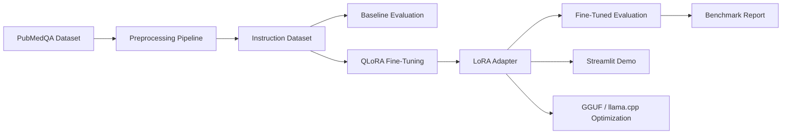
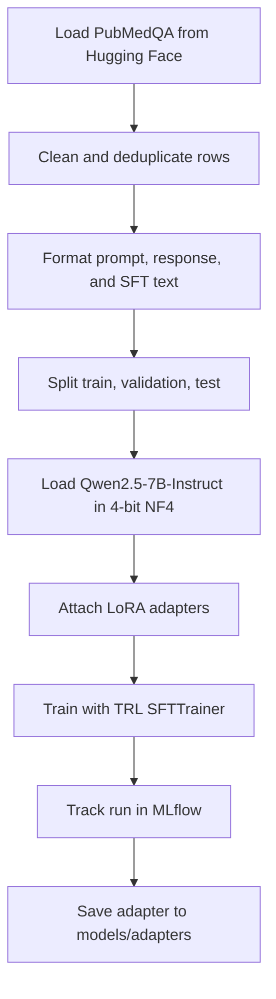
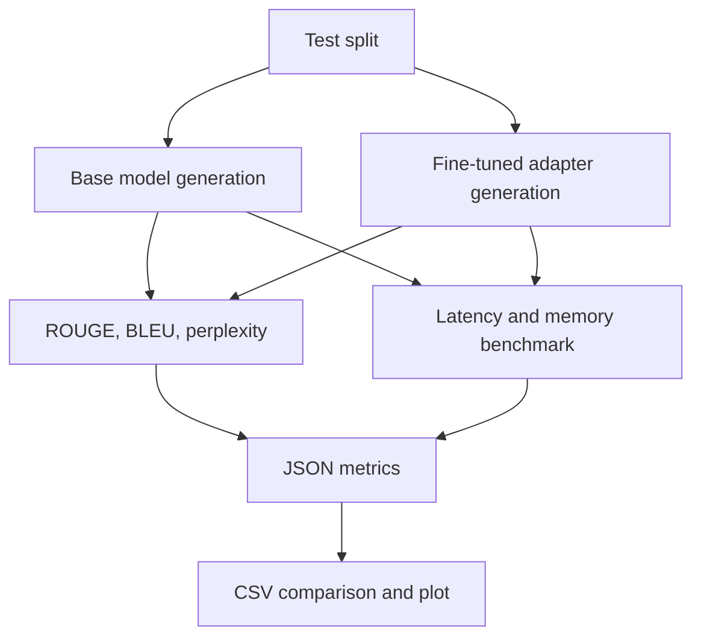
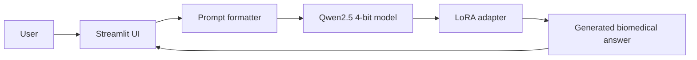
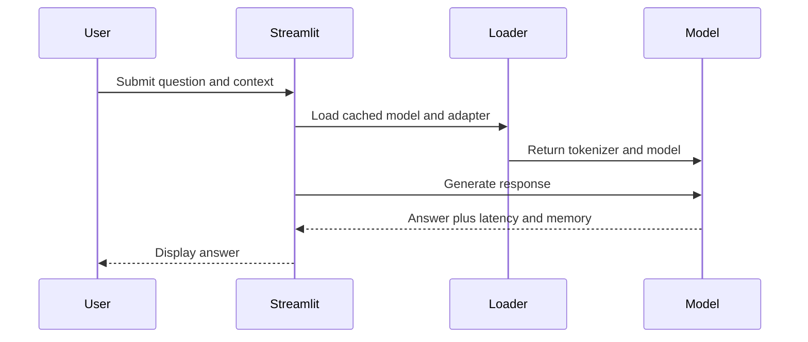

# System Architecture

## End-to-End Architecture

```mermaid
flowchart LR
    A["PubMedQA Dataset"] --> B["Preprocessing Pipeline"]
    B --> C["Instruction Dataset"]
    C --> D["Baseline Evaluation"]
    C --> E["QLoRA Fine-Tuning"]
    E --> F["LoRA Adapter"]
    F --> G["Fine-Tuned Evaluation"]
    G --> H["Benchmark Report"]
    F --> I["Streamlit Demo"]
    F --> J["GGUF / llama.cpp Optimization"]
```

## Training Workflow

```mermaid
flowchart TD
    A["Load PubMedQA from Hugging Face"] --> B["Clean and deduplicate rows"]
    B --> C["Format prompt, response, and SFT text"]
    C --> D["Split train, validation, test"]
    D --> E["Load Qwen2.5-7B-Instruct in 4-bit NF4"]
    E --> F["Attach LoRA adapters"]
    F --> G["Train with TRL SFTTrainer"]
    G --> H["Track run in MLflow"]
    H --> I["Save adapter to models/adapters"]
```

## Evaluation Workflow

```mermaid
flowchart TD
    A["Test split"] --> B["Base model generation"]
    A --> C["Fine-tuned adapter generation"]
    B --> D["ROUGE, BLEU, perplexity"]
    C --> D
    B --> E["Latency and memory benchmark"]
    C --> E
    D --> F["JSON metrics"]
    E --> F
    F --> G["CSV comparison and plot"]
```

## Deployment Architecture

```mermaid
flowchart LR
    A["User"] --> B["Streamlit UI"]
    B --> C["Prompt formatter"]
    C --> D["Qwen2.5 4-bit model"]
    D --> E["LoRA adapter"]
    E --> F["Generated biomedical answer"]
    F --> B
```

## API Flow

```mermaid
sequenceDiagram
    participant User
    participant Streamlit
    participant Loader
    participant Model
    User->>Streamlit: Submit question and context
    Streamlit->>Loader: Load cached model and adapter
    Loader->>Model: Return tokenizer and model
    Streamlit->>Model: Generate response
    Model-->>Streamlit: Answer plus latency and memory
    Streamlit-->>User: Display answer
```
