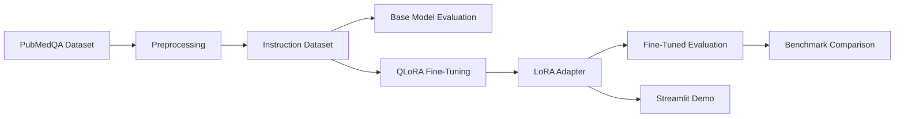

# Domain-Specific LLM Fine-Tuning using QLoRA with Benchmarking and Deployment

## Abstract

This project implements an end-to-end open-source pipeline for domain-specific large language model adaptation using Quantized Low-Rank Adaptation (QLoRA). A Qwen2.5-1.5B-Instruct model is fine-tuned on a PubMedQA-style biomedical question answering dataset, evaluated against the base model, and deployed through a lightweight Streamlit interface. The project emphasizes reproducibility, consumer-grade hardware feasibility, benchmark-driven evaluation, and local inference.

## Problem Statement

General-purpose instruction-tuned language models can answer biomedical questions, but they may produce responses that are not well aligned with domain-specific evidence. The objective of this project is to adapt an open-source model to biomedical research question answering while keeping training and deployment practical on a consumer GPU.

## Objectives

- Prepare a domain-specific biomedical QA dataset.
- Fine-tune an open-source LLM using QLoRA.
- Benchmark base and fine-tuned models using text quality, perplexity, latency, and memory metrics.
- Deploy the fine-tuned model in a lightweight local demo.
- Keep the complete implementation free, open-source, reproducible, and GitHub-ready.

## Dataset

The project uses a PubMedQA instruction-style dataset. Each sample is normalized into:

- Question: biomedical research question.
- Context: PubMed abstract or evidence passage.
- Reference answer: expected long-form answer.

The dataset is split into train, validation, and test sets. For the final run, the training configuration used a controlled subset to keep experimentation feasible on local hardware.

## Model Selection

The initial architecture supported Qwen2.5-7B-Instruct, but training time was high on 12 GB VRAM. The final implementation uses Qwen/Qwen2.5-1.5B-Instruct because it provides a better balance of:

- local training speed,
- low VRAM usage,
- open-source availability,
- deployment practicality,
- and sufficient quality for a Master's-level reproducible pipeline.

## Methodology

The system follows this workflow:

## QLoRA Fine-Tuning

QLoRA enables efficient supervised fine-tuning by loading the base model in 4-bit precision and training only small LoRA adapter matrices. The project uses:

- 4-bit NF4 quantization,
- PEFT LoRA adapters,
- TRL SFTTrainer,
- gradient checkpointing,
- paged AdamW 8-bit optimizer,
- MLflow experiment tracking.

Final training profile:

| Setting | Value |
|---|---:|
| Base model | Qwen/Qwen2.5-1.5B-Instruct |
| Max sequence length | 1024 |
| Training samples | 4000 |
| Validation samples | 300 |
| Max steps | 800 |
| LoRA rank | 16 |
| LoRA alpha | 32 |
| LoRA dropout | 0.05 |
| Batch size | 2 |
| Gradient accumulation | 4 |
| Learning rate | 2e-4 |

## Evaluation Metrics

The evaluation compares base and fine-tuned models on held-out test samples using:

- BLEU,
- ROUGE-1,
- ROUGE-2,
- ROUGE-L,
- perplexity,
- mean latency,
- p50 latency,
- p95 latency,
- peak GPU memory.

## Results

| Metric | Base Model | Fine-Tuned Model | Change |
|---|---:|---:|---:|
| BLEU | 3.266 | 4.837 | +1.571 |
| ROUGE-1 | 0.273 | 0.302 | +0.029 |
| ROUGE-2 | 0.072 | 0.108 | +0.036 |
| ROUGE-L | 0.167 | 0.216 | +0.049 |
| Perplexity | 10.342 | 9.340 | -1.003 |
| Mean latency | 4.206s | 2.155s | -2.052s |
| p50 latency | 4.146s | 2.120s | -2.026s |
| p95 latency | 7.147s | 3.250s | -3.897s |
| Peak memory max | 1236.874 MB | 1307.312 MB | +70.438 MB |

The fine-tuned adapter improves all text overlap metrics and reduces perplexity. This indicates that domain-specific QLoRA adaptation improves alignment with biomedical QA reference answers. Memory usage increases slightly due to the loaded adapter, which is expected.

## Deployment

The project includes a Streamlit interface for local demonstration. The app accepts a biomedical question and evidence context, loads the fine-tuned LoRA adapter, and generates an answer. A safety guard prevents generation when no context is provided, reducing unsupported biomedical hallucination.

The project also includes an optional FastAPI endpoint for API-style inference.

## Limitations

- The model is intended for biomedical literature QA, not clinical diagnosis.
- Evaluation uses lexical metrics, which do not fully capture factual correctness.
- The fine-tuning run uses a limited training subset for consumer-hardware feasibility.
- The deployed app does not yet include retrieval from PubMed or citation verification.

## Future Work

- Add retrieval-augmented generation over PubMed abstracts.
- Add human evaluation for factual consistency.
- Compare Qwen2.5-1.5B, Qwen2.5-3B, and Qwen2.5-7B.
- Export to GGUF and benchmark llama.cpp CPU/GPU inference.
- Add automated model cards and Hugging Face Hub publishing.

## Conclusion

This project demonstrates a complete production-style pipeline for domain-specific LLM adaptation using QLoRA. The fine-tuned Qwen2.5-1.5B model improves benchmark performance over the base model while remaining practical for local training and deployment. The final system is modular, reproducible, open-source, and suitable for a Master's Data Science major project.
